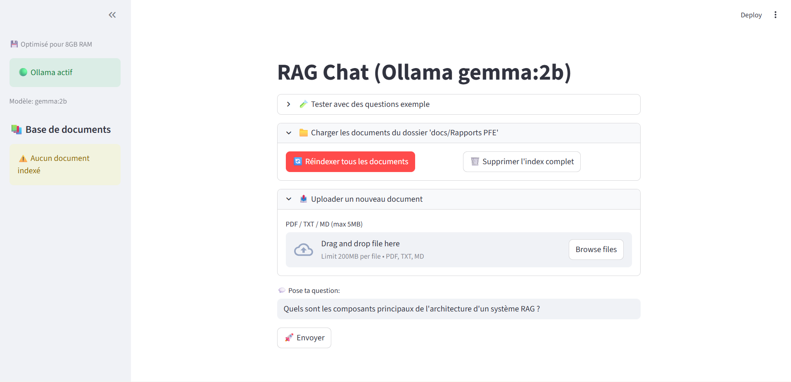
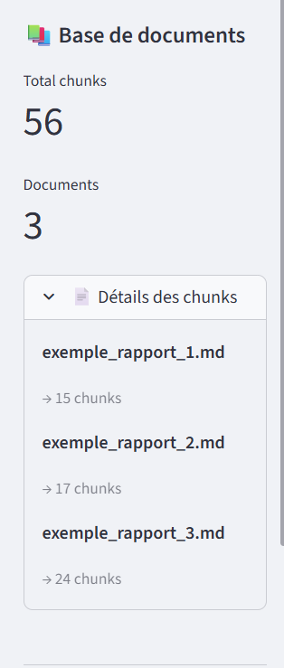
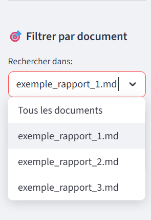
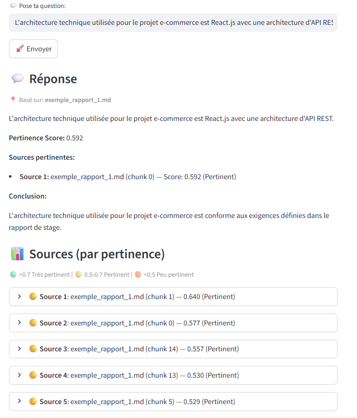
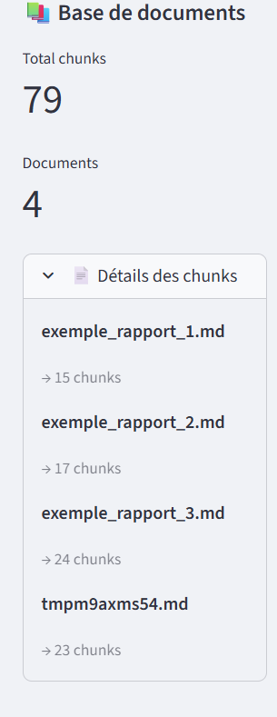
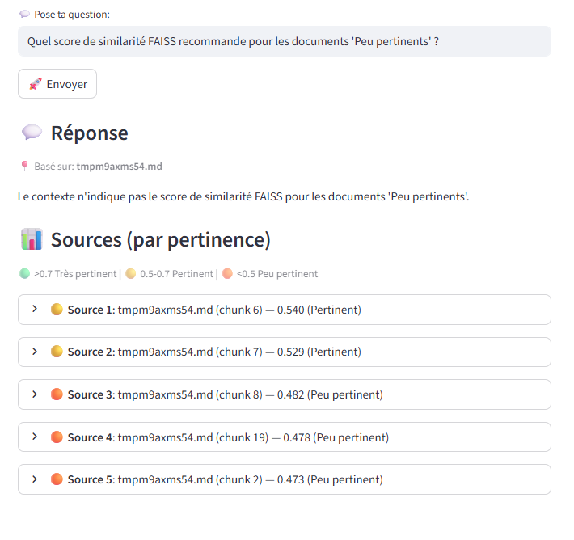

# 🤖 Small RAG System - Local Document Q&A

A lightweight Retrieval-Augmented Generation (RAG) system that runs entirely locally using Ollama (Gemma 2B) and FAISS vector search. Perfect for querying your documents privately without sending data to external APIs.

**Supported formats**: PDF, Markdown (.md), and plain text (.txt) files.

## 📋 Overview



The RAG Chat interface provides a clean, intuitive way to interact with your documents. It features:
- **Local LLM** via Ollama (Gemma 2B model)
- **FAISS vector indexing** for fast semantic search
- **Streamlit UI** for easy interaction
- **Optimized for 8GB RAM** systems

---

## 📚 Document Management

### Existing Documents Indexed



Documents are automatically chunked into semantic sections. The sidebar shows:
- Total number of chunks indexed
- Document count
- Detailed breakdown of chunks per document

---

### Filter by Document



You can narrow your search to specific documents using the document filter in the sidebar. This ensures answers are only drawn from the selected source.

---

## 💬 RAG Q&A Features

### Query Existing Documents



Ask questions about your indexed documents. The system:
- Retrieves the most relevant chunks (with similarity scores)
- Generates answers based only on retrieved context
- Shows sources with quality indicators (🟢 Very relevant, 🟡 Relevant, 🟠 Less relevant)

---

## 📤 Upload New Documents

### Add New Files



Simply drag and drop **PDF, Markdown, or TXT** files to add them to your knowledge base. The system:
- Automatically chunks and indexes new content
- Supports files up to 5MB
- Handles both PDF and Markdown formats equally
- Updates the index in real-time

---

### Accurate Answers from New Documents


Once indexed, new documents are immediately searchable and the system provides accurate, context-based answers with source attribution.

---

### Handling Edge Cases



When the system cannot find relevant information in the indexed documents, it clearly states "Je ne sais pas" (I don't know) rather than hallucinating an answer. This ensures reliability and trust.

---

## 🚀 Quick Start

### Prerequisites
```bash
pip install -r requirements.txt
ollama pull gemma:2b
```

### Run the App
```bash
streamlit run app.py
```

---

## 🛠️ Features

- ✅ **100% Local** - No data leaves your machine
- ✅ **Smart Chunking** - Preserves document structure and context
- ✅ **Source Attribution** - Every answer shows its sources
- ✅ **Quality Scoring** - Visual indicators for answer confidence
- ✅ **Document Filtering** - Search within specific documents
- ✅ **Memory Efficient** - Optimized batch processing for 8GB RAM
- ✅ **Reliable Fallbacks** - Honest "I don't know" responses

---

## 📁 Project Structure

```
Small_RAG_system/
├── app.py              # Streamlit UI
├── indexer.py          # FAISS indexing logic
├── rag_query.py        # Query & answer generation
├── rag_utils.py        # Text extraction & chunking
├── index.faiss         # Vector index (auto-generated)
├── meta.json           # Metadata store (auto-generated)
└── docs/               # Your documents folder
```

---

## 🧩 Tech Stack

- **LLM**: Ollama (Gemma 2B)
- **Embeddings**: sentence-transformers (all-MiniLM-L6-v2)
- **Vector DB**: FAISS (IndexFlatIP)
- **Frontend**: Streamlit
- **PDF Parsing**: PyMuPDF (fitz)

---

